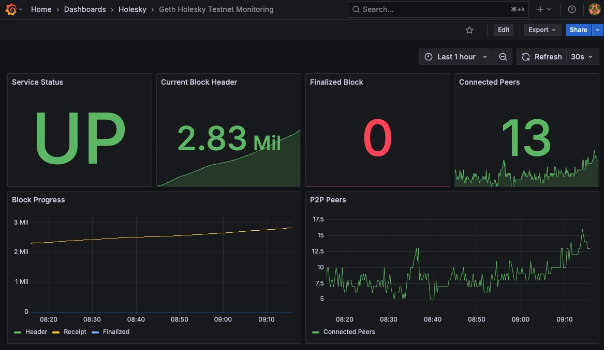

# Rocket Pool Ethereum Node com Monitoramento

Este projeto configura um nó Ethereum completo com Rocket Pool, incluindo cliente de execução (Geth), cliente de consenso (Lighthouse) e monitoramento via Prometheus e Grafana, com autenticação JWT.

## Screenshots

### Docker Desktop - Containers em Execução


### Dashboard Geth - Monitoramento de Execução



### Dashboard Lighthouse - Monitoramento de Consenso


### Script de Monitoramento - Status do Sistema


## Estrutura do Projeto

```text
rocketpool-eth-node/
├── alerts/
│   └── node-alerts.yml          # Alertas do Prometheus
├── consensus-data/              # Dados do Lighthouse
├── execution-data/              # Dados do Geth (inclui JWT secret)
├── grafana/
│   └── provisioning/
│       ├── dashboards/
│       │   ├── default.yml      # Configuração dos dashboards
│       │   ├── ethereum.json    # Dashboard principal Ethereum
│       │   └── geth.json        # Dashboard específico Geth
│       └── datasources/
│           └── prometheus.yml   # Configuração datasource Prometheus
├── rocketpool-data/             # Dados do Rocket Pool
├── docker-compose.yml           # Configuração original
├── docker-compose.ssd.yml       # Configuração para SSD externo
├── docker-compose-holesky.yml   # Configuração para testnet Holesky
├── .env.ssd                     # Variáveis de ambiente SSD
├── .env.holesky                 # Variáveis de ambiente testnet Holesky
├── setup-ssd.sh                 # Script de configuração SSD
├── setup-holesky.sh             # Script de configuração testnet Holesky
├── monitor-ssd.sh               # Script de monitoramento SSD
├── monitor-holesky.sh           # Script de monitoramento testnet Holesky
├── SSD-CONFIG.md                # Documentação SSD detalhada
├── QUICK-START-SSD.md           # Guia rápido SSD
├── STATUS-FINAL-SSD.md          # Status final da configuração SSD
├── TESTNET-HOLESKY-CONFIG.md    # Guia completo para configuração testnet
├── DASHBOARD-GETH-CORRIGIDO.md  # Documentação dashboard Geth
├── user-settings-holesky-example.yml # Exemplo user-settings para testnet
├── prometheus.yml               # Configuração do Prometheus (mainnet)
├── prometheus-holesky.yml       # Configuração do Prometheus (testnet)
└── README.md
```

## Configuração Padrão vs SSD Externo

### Configuração Padrão (Original)

- Dados armazenados localmente no diretório do projeto
- Use: `docker-compose up -d`

### Configuração SSD Externo (Recomendado)

- Dados armazenados em SSD externo de 1TB+
- Use: `./setup-ssd.sh` seguido de `docker-compose -f docker-compose.ssd.yml --env-file .env.ssd up -d`
- **Vantagens**: Mais espaço, melhor performance, portabilidade
- **Documentação**: Veja [SSD-CONFIG.md](SSD-CONFIG.md) e [QUICK-START-SSD.md](QUICK-START-SSD.md)

### Configuração Testnet (Para Aprendizado)

- Configuração na testnet Holesky para aprender sem riscos
- ETH gratuito via faucets, sincronização rápida (~2 horas)
- **Inicialização rápida**: `./setup-holesky.sh`
- **Iniciar sistema**: `docker-compose -f docker-compose-holesky.yml --env-file .env.holesky up -d`
- **Monitoramento**: `./monitor-holesky.sh`
- **Documentação**: Veja [TESTNET-HOLESKY-CONFIG.md](TESTNET-HOLESKY-CONFIG.md)

## Pré-requisitos

- Docker e Docker Compose instalados
- **Para SSD Externo**: SSD externo de 1TB+ (recomendado)
- **Para configuração padrão**: Pelo menos 1TB de espaço livre em disco
- 16GB+ de RAM (32GB recomendado)
- Conexão estável à internet
- Portas abertas no firewall:
  - `30303` - P2P Geth (TCP/UDP)
  - `9000` - P2P Lighthouse (TCP/UDP)
  - `8545` - RPC HTTP Geth
  - `8551` - RPC autenticado Geth (JWT)
  - `9090` - Prometheus
  - `3000` - Grafana
  - `8000` - Rocket Pool (se necessário)

## Como Executar

### Início Rápido

```bash
docker-compose up -d
```

### Passo a Passo Detalhado

1. Clone este repositório:

   ```bash
   git clone https://github.com/seu-usuario/rocketpool-eth-node.git
   cd rocketpool-eth-node
   ```

2. Configure os volumes e as portas conforme necessário no `docker-compose.yml` (se necessário).

3. Inicie os contêineres:

   ```bash
   docker-compose up -d
   ```

4. Verifique o status no Docker Desktop ou via linha de comando (veja screenshot do Docker Desktop acima):

   ```bash
   docker ps
   ```

5. Acompanhe os logs:

   ```bash
   docker-compose logs -f
   ```

6. Verifique o status dos contêineres:

   ```bash
   docker ps
   ```

## Acessando os Serviços

### Interfaces Web

- **Grafana**: <http://localhost:3000>
  - Usuário: `admin`
  - Senha: `admin`
  - **Dashboards disponíveis na pasta "Ethereum"**:
    - `Ethereum` - Dashboard principal com métricas gerais (Geth + Lighthouse)
    - `Geth` - Dashboard específico do cliente de execução
  - Data source Prometheus configurado automaticamente

- **Prometheus**: <http://localhost:9090>
  - Interface para consultar métricas e verificar alertas

### APIs e RPC

- **Geth RPC**: <http://localhost:8545>
  - Endpoint HTTP para interação com o cliente de execução

```bash
# Teste de conectividade
curl -X POST -H "Content-Type: application/json" \
  --data '{"jsonrpc":"2.0","method":"web3_clientVersion","params":[],"id":1}' \
  http://localhost:8545
```

## Arquitetura e Componentes

### Cliente de Execução (Geth)

- **Imagem**: `ethereum/client-go:stable`
- **Modo de Sincronização**: Snap sync
- **JWT Authentication**: Configurado para comunicação segura
- **Portas**: 30303 (P2P), 8545 (HTTP RPC), 8551 (Auth RPC)

### Cliente de Consenso (Lighthouse)

- **Imagem**: `sigp/lighthouse:latest`
- **Checkpoint Sync**: Habilitado para sincronização rápida
- **JWT Authentication**: Conectado ao Geth via porta 8551
- **Portas**: 9000 (P2P)

### Rocket Pool

- **Imagem**: `rocketpool/smartnode:latest`
- **Dependências**: Aguarda Geth e Lighthouse estarem prontos
- **Configuração**: Arquivo de configuração será criado na primeira execução

### Monitoramento

- **Prometheus**: Coleta métricas de todos os clientes
- **Grafana**: Visualização e dashboards
- **Alertas**: Configurados para cenários críticos

## Monitoramento e Alertas

### Métricas Coletadas

- **Prometheus** coleta métricas de todos os clientes automaticamente
- **Grafana** apresenta dashboards pré-configurados para:
  - Ethereum node (Geth e Lighthouse) - *veja screenshots das dashboards acima*
  - Rocket Pool específico
  - Saúde dos contêineres

### Dashboards de Monitoramento

- **Dashboard Geth**: Monitora sincronização, peers, performance do cliente de execução
- **Dashboard Lighthouse**: Acompanha beacon chain, validadores, status de consenso
- **Status do Sistema**: Script de monitoramento que mostra status geral dos containers

### Alertas Configurados

- Queda do Execution Client
- Falha no Consensus Client  
- Validador offline
- Baixa performance do node

### Acesso às Interfaces

- **Grafana**: <http://localhost:3000> (admin/admin)
- **Prometheus**: <http://localhost:9090>
- **Script de Monitor**: `./monitor-holesky.sh` ou `./monitor-ssd.sh`

## Comandos Úteis

### Gerenciamento dos Contêineres

```bash
# Iniciar todos os serviços
docker-compose up -d

# Parar todos os serviços
docker-compose down

# Ver logs em tempo real
docker-compose logs -f

# Ver logs de um serviço específico
docker-compose logs -f execution-client
docker-compose logs -f consensus-client
docker-compose logs -f rocketpool-node

# Reiniciar um serviço específico
docker-compose restart consensus-client

# Ver status dos contêineres
docker ps
```

### Scripts de Monitoramento

O projeto inclui scripts específicos para monitoramento do sistema (veja screenshot do monitor acima):

```bash
# Para testnet Holesky
./monitor-holesky.sh           # Verificação única
./monitor-holesky.sh watch     # Monitoramento contínuo
./monitor-holesky.sh sync      # Apenas sincronização
./monitor-holesky.sh containers # Apenas containers

# Para configuração SSD
./monitor-ssd.sh               # Verificação única
./monitor-ssd.sh watch         # Monitoramento contínuo
```

### Verificação de Saúde

```bash
# Verificar se Geth está respondendo
curl -X POST -H "Content-Type: application/json" \
  --data '{"jsonrpc":"2.0","method":"web3_clientVersion","params":[],"id":1}' \
  http://localhost:8545

# Verificar peers conectados
curl -X POST -H "Content-Type: application/json" \
  --data '{"jsonrpc":"2.0","method":"net_peerCount","params":[],"id":1}' \
  http://localhost:8545

# Verificar status de sincronização
curl -X POST -H "Content-Type: application/json" \
  --data '{"jsonrpc":"2.0","method":"eth_syncing","params":[],"id":1}' \
  http://localhost:8545
```

## Importante - JWT Authentication

Este setup implementa corretamente a autenticação JWT entre os clientes:

- **Geth** gera automaticamente o JWT secret em `/root/.ethereum/jwtsecret`
- **Lighthouse** usa o mesmo JWT token para comunicação segura
- **Porta 8551** é usada para comunicação autenticada (não HTTP público)
- **Porta 8545** continua disponível para RPC HTTP público

## Processo de Sincronização

### Primeira Execução

1. **Geth** iniciará o download da blockchain (pode levar várias horas)
2. **Lighthouse** usará checkpoint sync para sincronização rápida
3. **Rocket Pool** aguardará ambos os clientes estarem sincronizados

### Tempos Estimados

- **Checkpoint Sync (Lighthouse)**: 5-15 minutos
- **Snap Sync (Geth)**: 2-6 horas (dependendo do hardware e internet)
- **Sincronização completa**: 4-8 horas

## Configuração Completa do Node e Dashboards

### Passo 1: Inicialização dos Clientes

```bash
# 1. Iniciar todos os serviços
docker-compose up -d

# 2. Verificar status dos contêineres
docker ps

# 3. Acompanhar logs em tempo real
docker-compose logs -f
```

### Passo 2: Verificar Sincronização

```bash
# Verificar sincronização do Geth
curl -X POST -H "Content-Type: application/json" \
  --data '{"jsonrpc":"2.0","method":"eth_syncing","params":[],"id":1}' \
  http://localhost:8545

# Verificar peers conectados
curl -X POST -H "Content-Type: application/json" \
  --data '{"jsonrpc":"2.0","method":"net_peerCount","params":[],"id":1}' \
  http://localhost:8545

# Verificar status do Lighthouse
docker logs --tail=20 consensus-client
```

### Passo 3: Configurar Rocket Pool

1. **Aguardar Sincronização**: Espere Geth e Lighthouse sincronizarem (pode levar algumas horas)

2. **Configurar Rocket Pool**:

   ```bash
   # Parar o Rocket Pool temporariamente
   docker stop rocketpool-node

   # Criar configuração básica
   mkdir -p rocketpool-data/.rocketpool

   # O arquivo user-settings.yml já está criado automaticamente
   ```

3. **Iniciar Rocket Pool**:

   ```bash
   docker start rocketpool-node
   ```

### Passo 4: Configurar Dashboards do Grafana

1. **Acessar Grafana**: <http://localhost:3000>
   - Usuário: `admin`
   - Senha: `admin`

2. **Dashboards Pré-configurados**:
   - Os dashboards já são automaticamente provisionados durante a inicialização
   - Disponíveis na pasta "Ethereum":
     - **Ethereum**: Dashboard principal com métricas gerais dos clientes
     - **Geth**: Dashboard específico do cliente de execução
   - Data source Prometheus configurado automaticamente

3. **Localização dos Arquivos**:
   - Dashboards: `grafana/provisioning/dashboards/`
   - Configuração: `grafana/provisioning/dashboards/default.yml`
   - Data sources: `grafana/provisioning/datasources/prometheus.yml`

### Passo 5: Monitoramento de Métricas

Após a sincronização completa, as seguintes métricas estarão disponíveis:

**Geth (Execution Client)**:

- URL: <http://localhost:6060/debug/metrics/prometheus>
- Métricas: blocos, peers, memória, CPU, transações

**Lighthouse (Consensus Client)**:

- URL: <http://localhost:5054/metrics>
- Métricas: validadores, slots, attestations, sincronização

**Prometheus**:

- URL: <http://localhost:9090>
- Interface para consultar métricas diretamente

### Passo 6: Comandos de Verificação

```bash
# Status dos contêineres
docker ps

# Logs específicos
docker logs execution-client
docker logs consensus-client
docker logs rocketpool-node
docker logs prometheus
docker logs grafana

# Verificar métricas do Prometheus
curl -s http://localhost:9090/api/v1/targets

# Testar conectividade RPC
curl -X POST -H "Content-Type: application/json" \
  --data '{"jsonrpc":"2.0","method":"web3_clientVersion","params":[],"id":1}' \
  http://localhost:8545
```

### Passo 7: Configuração Avançada

**Personalizar Alertas**:

```bash
# Editar alertas personalizados
nano alerts/node-alerts.yml
```

**Configurar Backup Automático**:

```bash
# Script de backup dos dados importantes
tar -czf backup-$(date +%Y%m%d).tar.gz \
  execution-data/geth/keystore \
  consensus-data/mainnet/beacon/validator_db \
  rocketpool-data/.rocketpool
```

**Otimização de Performance**:

- Use SSD para armazenamento
- Mínimo 16GB RAM (32GB recomendado)
- Conexão de internet estável (100Mbps+)

### Tempos Estimados de Sincronização

| Componente | Tempo Estimado | Observações |
|------------|----------------|-------------|
| **Lighthouse** | 5-15 minutos | Checkpoint sync ativo |
| **Geth** | 2-6 horas | Snap sync, depende do hardware |
| **Rocket Pool** | Após sincronização | Aguarda clientes prontos |

### Resolução de Problemas Comuns

**Problema**: Lighthouse não conecta ao Geth

```bash
# Verificar JWT token
cat execution-data/geth/jwtsecret
docker logs consensus-client | grep -i jwt
```

**Problema**: Métricas não aparecem no Grafana

```bash
# Verificar targets do Prometheus
curl -s http://localhost:9090/api/v1/targets

# Reiniciar serviços de monitoramento
docker-compose restart prometheus grafana
```

**Problema**: Rocket Pool reiniciando constantemente

```bash
# Verificar configuração
cat rocketpool-data/.rocketpool/user-settings.yml
docker logs rocketpool-node
```

## Dashboards do Grafana

### Dashboards Pré-configurados

O projeto inclui dashboards pré-configurados que são automaticamente provisionados:

1. **Dashboard Ethereum** (`ethereum.json`):
   - Visão geral dos clientes de execução e consenso
   - Métricas de rede, peers, sincronização
   - Status geral do nó Ethereum

2. **Dashboard Geth** (`geth.json`):
   - Métricas específicas do cliente de execução
   - Performance, memória, CPU
   - Estatísticas de blocos e transações

### Estrutura dos Dashboards

```text
grafana/provisioning/
├── dashboards/
│   ├── default.yml      # Configuração de provisionamento
│   ├── ethereum.json    # Dashboard principal
│   └── geth.json        # Dashboard Geth
└── datasources/
    └── prometheus.yml   # Data source Prometheus
```

### Características

- **Provisionamento Automático**: Dashboards são carregados automaticamente na inicialização
- **Pasta "Ethereum"**: Todos os dashboards ficam organizados na pasta "Ethereum" no Grafana
- **Data Source**: Prometheus configurado automaticamente como data source
- **Métricas Reais**: Dashboards usam apenas métricas disponíveis nos clientes

Para detalhes técnicos sobre o dashboard Geth, consulte `DASHBOARD-GETH-CORRIGIDO.md`.

## Contribuição

Contribuições são bem-vindas! Por favor:

1. Faça fork do projeto
2. Crie uma branch para sua feature (`git checkout -b feature/AmazingFeature`)
3. Commit suas mudanças (`git commit -m 'Add some AmazingFeature'`)
4. Push para a branch (`git push origin feature/AmazingFeature`)
5. Abra um Pull Request

## Licença

Este projeto está sob a licença MIT. Veja o arquivo `LICENSE` para mais detalhes.

## CONFIGURAÇÃO SSD CONCLUÍDA COM SUCESSO

**Data da Conclusão**: 28 de Junho de 2025  
**Status**: OPERACIONAL

### Validação Completa Realizada

A configuração do Rocket Pool Ethereum Node no SSD externo Kingston 1TB foi **concluída com sucesso** e está totalmente funcional:

- **Execution Client (Geth)**: Sincronizando com a rede Ethereum
- **Consensus Client (Lighthouse)**: Conectado e funcionando  
- **Monitoramento**: Prometheus + Grafana operacionais com dashboards configurados
- **Dashboards**: Ethereum e Geth disponíveis na pasta "Ethereum"
- **Armazenamento**: Todos os dados gravados no SSD (~500MB utilizados de 1TB)
- **Scripts**: Setup e monitoramento funcionais

### Arquivos de Configuração SSD Criados

```txt
SSD-CONFIG.md          # Documentação técnica completa
QUICK-START-SSD.md     # Guia rápido de uso  
STATUS-FINAL-SSD.md    # Relatório final detalhado
docker-compose.ssd.yml # Compose específico para SSD
.env.ssd              # Variáveis de ambiente SSD
setup-ssd.sh          # Script de configuração automática
monitor-ssd.sh        # Script de monitoramento
```

### Como Usar

```bash
# Iniciar sistema completo no SSD
docker-compose -f docker-compose.ssd.yml --env-file .env.ssd up -d

# Monitorar status
./monitor-ssd.sh

# Acessar dashboards
open http://localhost:3000  # Grafana (admin/admin)
open http://localhost:9090  # Prometheus
```

### Status Atual

- **Espaço SSD**: 724GB livres (75% disponível)
- **Containers**: 5/5 funcionando (Rocket Pool temporariamente desabilitado)
- **Sincronização**: Em progresso
- **Monitoramento**: Ativo e coletando métricas

Para detalhes completos, consulte `STATUS-FINAL-SSD.md`.

---
